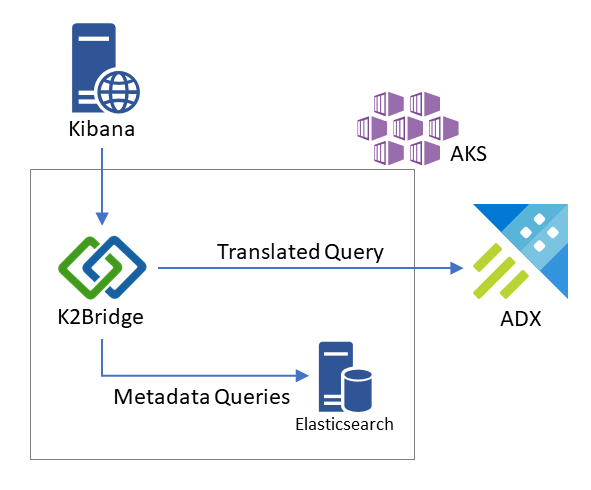

# K2Bridge

K2Bridge is a solution that enables Kibana to use [Azure Data Explorer](https://azure.microsoft.com/en-us/services/data-explorer/) (ADX, or codename Kusto) as its backend database.

---

[](https://dev.azure.com/csedevil/Kibana-kusto-bridge/_build/latest?definitionId=140&branchName=master)
[](http://opensource.org/licenses/MIT)

## Description

The K2Bridge solution is a proxy capable of communicating with the Kibana application and translate its queries to [KQL](https://docs.microsoft.com/en-us/azure/kusto/query/), the query language of the Azure Data Explorer service.
The solution currently targets the "Discover" tab in Kibana to enable users to quickly and interactively explore their data. It supports the filters and well as the search box in the screen with both simple term search and Lucene expressions.

### How does it work



The K2Bridge is the endpoint exposed to clients and the one Kibana connects to. Internally, a small elasticsearch is being used to service metadata related requests (like: which index-patterns we have, etc.). Note that no business data is actually saved in this internal instance and it can be considered as an implementation detail (could be removed in the future).
The bridge accept each request and redirects business (data) requests to ADX and metadata requests to the metadata store.

### Some differences you should know about

1. Partial support for Azure Data Explorer's `dynamic column` - those columns represent objects with unknown schema. Those columns are visible in the item view as "flat" properties, however, their 1-click search icons (the +/-) are disabled. Additionally, those columns won't appear in the add filter option.

TODO: update if/when we add support for dynamic columns. https://dev.azure.com/csedevil/K2-bridge-internal/_workitems/edit/1253

Options for better interaction with dynamic columns:
    * Use Lucene expressions in the search box with a fully qualified property path. For example: propertyA.propertyB:myValue
    * If possible, consider promoting some/all properties in a dynamic column to regular-discreet columns in Azure Data Explorer. By doing so, you'll also get a potential performance boost when search.

1. We currently don't have a plan to support Visualize or Dashboards in Kibana but will be interested in your feedback regarding those missing features.
TODO: how would they give feedback?
1. We have used and tested the OSS version of Kibana. Using other versions might work but you would probably need to disable various modules.

## Installing

K2Bridge deploys to Kubernetes. Instructions are available [here](./docs/installation.md).
TODO: replace with a quick install guide when images are public.

## Connecting data

The application settings contains the credentials for a service principal and a
reference to an ADX cluster and a default database within the cluster (`adxDefaultDatabaseName`).

The application surfaces the following data from ADX as indexes into Kibana:

* **Tables** located in any database on the ADX cluster, regardless of the `adxDefaultDatabaseName` setting, provided:
  * The service principal has Viewer permissions on the table.
* **Functions** located in the `adxDefaultDatabaseName` database only, provided:
  * The service principal has Viewer permissions on the function.
  * The function does not take any parameters.

ADX functions without parameters are similar in nature to views in relational databases.
Through functions, you can perform [cross-database and cross-cluster queries](https://docs.microsoft.com/en-us/azure/kusto/query/cross-cluster-or-database-queries) as well as 
queries into
[Azure Monitor (Application Insights and Log Analytics)](https://docs.microsoft.com/en-us/azure/data-explorer/query-monitor-data), provided the service principal has adequate permissions
on the external resources.
For example:

```
.create function ListContainers() {
    cluster('https://ade.loganalytics.io/subscriptions/00000000-0000-0000-0000-000000000000/resourceGroups/my-rg/providers/Microsoft.OperationalInsights/workspaces/k8s-workspace-0000')
    .database('k8s-workspace-0000')
    .ContainerInventory | limit 100
}
```

Note that you cannot connect K2Bridge directly to Azure Monitor, you need an ADX instance
serving as broker. Be very mindful of the performance impact of such distributed queries,
which can easily result into Kibana timeouts.

## Developing

Information on how to run Kibana and K2Bridge locally for development and testing can be found [here](./docs/development.md).

## Prometheus Support
K2Bridge supports the Prometheus protocol for metrics reporting.
Supported exposition formats are the 0.0.4 text and protocol buffer formats.

More on the formats can be found at the [Prometheus documentations](https://prometheus.io/docs/instrumenting/exposition_formats/)

Kibana Kusto Bridge would reply based on the content type header, so pointing your browser to:
`http://bridge-host/metrics/` will return a text representation of the metrics with their documentation.

## Contributing

This project welcomes contributions and suggestions. Most contributions require you to agree to a Contributor License Agreement (CLA) declaring that you have the right to, and actually do, grant us the rights to use your contribution. For details, visit [https://cla.opensource.microsoft.com](https://cla.opensource.microsoft.com).

When you submit a pull request, a CLA bot will automatically determine whether you need to provide a CLA and decorate the PR appropriately (e.g., status check, comment). Simply follow the instructions provided by the bot. You will only need to do this once across all repos using our CLA.

This project has adopted the [Microsoft Open Source Code of Conduct](https://opensource.microsoft.com/codeofconduct/).
For more information see the [Code of Conduct FAQ](https://opensource.microsoft.com/codeofconduct/faq/) or contact [opencode@microsoft.com](mailto:opencode@microsoft.com) with any additional questions or comments.
