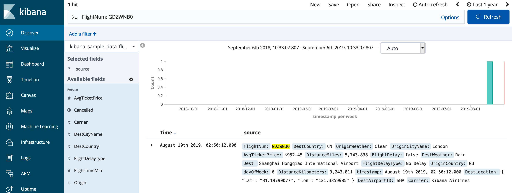

# Development

## Setting up a local environment

1. Download [Elasticsearch](https://www.elastic.co/downloads/past-releases/elasticsearch-oss-6-8-6) (currently we support version 6.8.*), unpack and run.
1. Download [Kibana](https://www.elastic.co/downloads/past-releases/kibana-oss-6-8-6) (currently we support version 6.8.*) and unpack
1. Under Kibana's '*config*' directory, edit the *kibana.yml* file and add the following line. Note that this assumes that the bridge will listen on port 8080 which you'll set in the steps below.

    ```yaml
    elasticsearch.hosts: ["http://127.0.0.1:8080"]
    ```

1. Clone KibanaKustoBridge repository
1. Create a new settings file and name it _K2Bridge/appsettings.development.json_, and configuration as demonstrated in [appsettings.json](../K2Bridge/appsettings.json). Below you can see a common settings file suitable for development:

    ```json
    {
      "aadClientId": "<aadClientId>",
      "aadClientSecret": "<aadClientSecret>",
      "aadTenantId": "<aadTenantId>",
      "adxClusterUrl": "<adxClusterUrl>",
      "adxDefaultDatabaseName": "<adxDefaultDatabaseName>",
      "bridgeListenerAddress": "http://127.0.0.1:8080/", //this needs to be identical to what kibana will connect to
      "metadataElasticAddress": "http://localhost:9200",
      "outputBackendQuery": "true",
      "collectTelemetry": "false", //unless you want to work on app-insights
      "enableQueryLogging": "true",

       //this section overrides default Serilog configuration to make it easier to develop and see logs.
      "Serilog": {
        "Using": [ "Serilog.Sinks.Console", "Serilog.Filters.Expressions" ],
        "MinimumLevel": {
          "Default": "Verbose",
          "Override": {
            "Microsoft": "Warning",
            "Microsoft.AspNetCore": "Warning",
            "Serilog.AspNetCore.RequestLoggingMiddleware": "Warning",
            "System": "Warning"
          }
        },
        "WriteTo": [
          {
            "Name": "Console",
            "Args": {
              "outputTemplate": "[{Timestamp:o} {CorrelationId} {Level:u3} {SourceContext}] {Message:lj}{NewLine}{Exception}"
            }
          }
        ],
        "Enrich": [ "FromLogContext", "WithCorrelationId", "WithCorrelationIdHeader" ]
      }
    }
    ```

1. Start the proxy (and Kibana + Elasticsearch if not already running)
1. Browse to the Kibana UI [http://localhost:5601/](http://localhost:5601/)

### Data and comparing results

We want to be able to compare the results we get between Elasticsearch and ADX. To do so we need the exact same data available in both data-stores.

Kibana offers sample data and an easy way to import it to Elasticsearch. The caveat is that while doing so, it also shifts all the timestamps to start near the import time (and last over a period of a few weeks to the future).
After doing that in Kibana you'll need to export data from Elasticsearch and import it to Kusto.
[elastidump](https://github.com/taskrabbit/elasticsearch-dump) is a utility able to import/export Elasticsearch data (as well as mappings and other objects). You can use it to export the data from Elasticsearch and then import it to ADX.

You can see example Kusto commands [here](tables.kql). Those commands include tables creation and how to convert an item-object to discreet fields.

## Testing

The easiest way to run and debug is by using Visual Studio with the [solution file](../KibanaKustoBridge.sln) included in the root folder of this repository.
More options are described below.

### Running Unit-tests from the command line

```sh
dotnet test ./tests/K2BridgeUnitTests/K2BridgeUnitTests.csproj
```

### Debugging Unit-tests in VS Code

In this mode you'll need to attach the debugger to the process.

1. Set environment variable:
    1. On Mac/Linux:

        ```sh
        export VSTEST_HOST_DEBUG=1
        ```

    1. On Windows (using Powershell)

        ```sh
        $env:VSTEST_HOST_DEBUG=1
        ```

1. Run the tests

```sh
dotnet test ./tests/K2BridgeUnitTests/K2BridgeUnitTests.csproj
```

You'll be prompted to attach a debugger to the test process.
Navigate to the debug tab and select the “.NET Core Attach” configuration from the dropdown.
Press the green play button and select the testhost process.

Once the debugger attaches, press the play button again.

### Manual testing

1. Go to the *Discover* tab
1. Choose a time window which includes data
1. Optionally include search term or filters
1. Entries from the Kusto table should appear in the search result



### End2End tests

The end-to-end test suite requires an existing installation of K2Bridge,
as well as a standalone installation of Elasticsearch,
to run parallel queries and compare the outputs.

A convenient way to run the tests locally is to connect to a Kubernetes
cluster that already has the services deployed.

```sh
az aks get-credentials -g $RESOURCE_GROUP -n aks-k2bridge-qa
kubectl port-forward service/elasticsearchqa-master 9200 &
kubectl port-forward service/k2bridge 8080 &
dotnet test K2Bridge.Tests.End2End
```

## Sensitive Information in logs

The application logs might contain sensitive information, mainly in the query text, which users would like to redact.
A special settings flag `enableQueryLogging` is used to control logging this type of information. When set to `true` the system behaves normally and logs include all the information.
However, when to `false` (the default), the system will redact "sensitive" information from the logs.

The decision of what is considered sensitive is **up to the developer** and implemented by using an object called `SensitiveData` (a wrapper for the data to be logged).
The logger considers `enableQueryLogging` and outputs the value of the `SensitiveData` object accordingly.
An extension method to create this object is also provided.

Here is an example for using the extension and conditional logs:

```C#
using K2Bridge.Telemetry;

// Creating a variable with potential sensitive information.
var translatedQuery = translator.Translate(header, query);

// Logging the header normally, and the potential sensitive data
// Is being converted to a conditional log object using "ToSensitiveData()"
// Please note the use of "@" which is used by Serilog to write all properties.
logger.LogDebug("Header:{@header}, query: {@QueryCommandText}", header, translatedQuery.QueryCommandText.ToSensitiveData());
```
