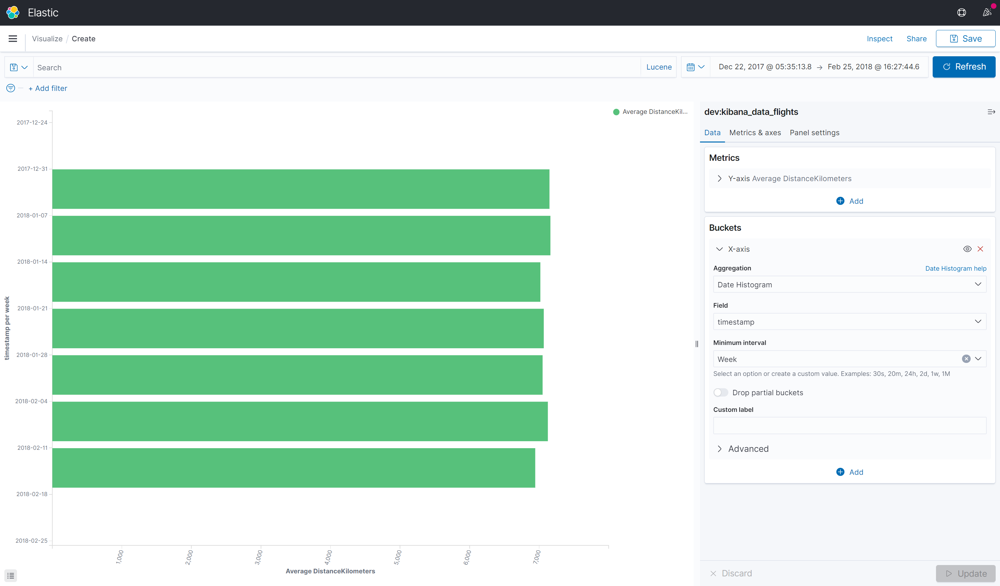

# Date histogram aggregation

This multi-bucket aggregation is similar to the normal [histogram](./histogram.md), but it can only be used with date or date range values.

[Date histogram aggregation (Elasticsearch)](https://www.elastic.co/guide/en/elasticsearch/reference/current/search-aggregations-bucket-datehistogram-aggregation.html)



You will find below an example of the Kusto Query Language generated by K2Bridge when using this aggregation (indentation added for legibility).

```
let _data = database(\"dev\").kibana_data_flights
| where (['timestamp'] >= todatetime(\"2017-12-22T04:35:13.8660000Z\") and ['timestamp'] <= todatetime(\"2018-02-25T15:27:44.6930000Z\"));

let _extdata = _data
| extend ['3'] = startofweek(['timestamp']);

let _summarizablemetrics = _extdata
| summarize ['2']=avg(['DistanceKilometers']),count() by ['3']
| order by ['3'] asc;

(_summarizablemetrics\n| as aggs);
```
