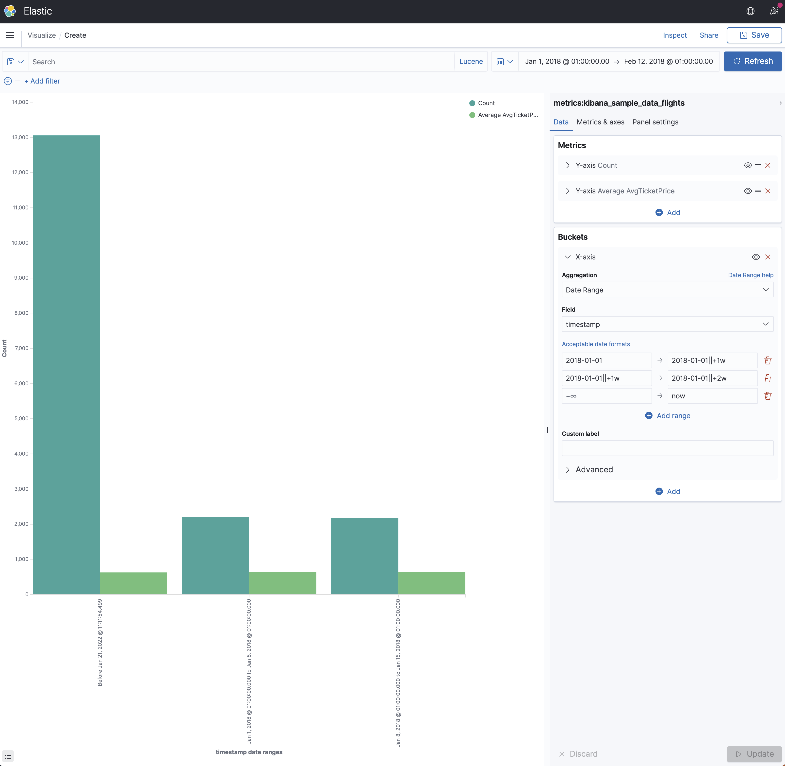

# Date Range

This is a range aggregation that is dedicated for date values. Each date (from and to) can be expressed as a Date Math expression, which allows absolute dates, date operations (addition/subtraction), and rounding. You can learn about this format by clicking on the "Acceptable date formats" link in Kibana.



You will find below an example of the Kusto Query Language generated by K2Bridge when using this aggregation (indentation added for legibility).

```
let _data = database("metrics").['kibana_sample_data_flights']
| where (
    ['timestamp'] >= todatetime("2018-01-01T00:00:00.0000000Z") 
    and ['timestamp'] <= todatetime("2018-02-12T00:00:00.0000000Z")
);

let _extdata = _data
| extend ['2'] = pack_array
    (
        strcat(make_datetime('2018-01-01'), '%', make_datetime('2018-01-02')),
        strcat(make_datetime('2018-01-02'), '%', make_datetime('2018-01-03'))
    ),
    ['_range_value'] = pack_array
    (
        ['timestamp'] >= make_datetime('2018-01-01') and ['timestamp'] < make_datetime('2018-01-02'),
        ['timestamp'] >= make_datetime('2018-01-02') and ['timestamp'] < make_datetime('2018-01-03')
    )
| mv-expand ['2'] to typeof(string), ['_range_value']
| where ['_range_value'] == true;

let _summarizablemetrics = _extdata
| summarize count() by ['2']
| order by ['2'] asc;

(_summarizablemetrics | as aggs);
```
