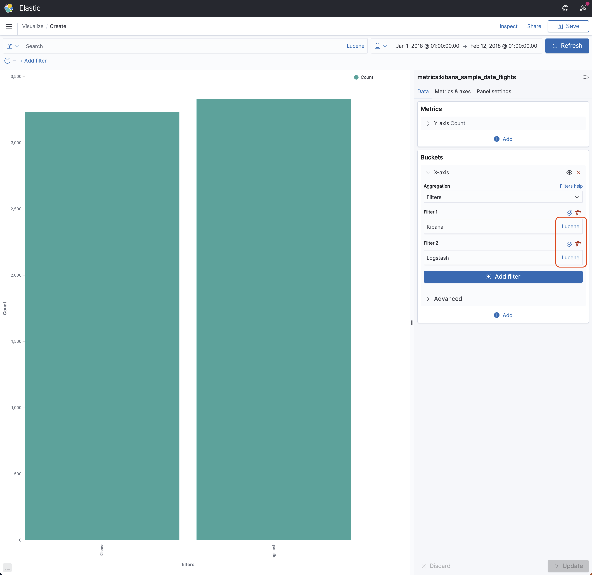

# Filters

Filters is a multi-bucket aggregation where each bucket contains the documents that match a query.

**Important note:** K2Bridge only supports the Lucene syntax for queries. Make sure you change the default syntax in the Filters aggregation ("KQL) to "Lucene", using the button next to the search box.



You will find below an example of the Kusto Query Language generated by K2Bridge when using this aggregation (indentation added for legibility).

```
let _data = database("metrics").['kibana_sample_data_flights']
| where (
    ['timestamp'] >= todatetime("2018-01-01T00:00:00.0000000Z") 
    and ['timestamp'] <= todatetime("2018-02-12T00:00:00.0000000Z")
);

let _extdata = _data
| extend ['2'] = pack_array
    (
        'Kibana', 'Logstash'
    ),
    ['_filter_value'] = pack_array
    (
        (* has \"Kibana\"), (* has \"Logstash\")
    )
| mv-expand ['2'] to typeof(string), ['_filter_value']
| where ['_filter_value'] == true;

let _summarizablemetrics = _extdata
| summarize count() by ['2']
| order by ['2'] asc;

(_summarizablemetrics | as aggs);
```
