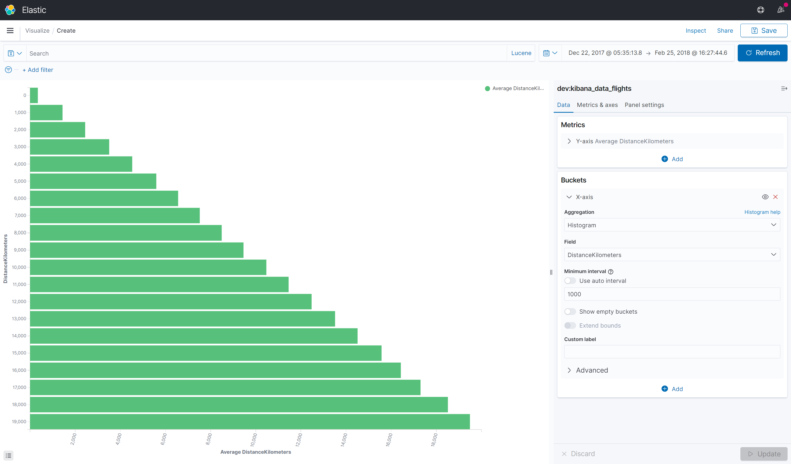

# Histogram aggregation

A multi-bucket values source based aggregation that can be applied on numeric values or numeric range values extracted from the documents. It dynamically builds fixed size (a.k.a. interval) buckets over the values.

[Histogram aggregation (Elasticsearch)](https://www.elastic.co/guide/en/elasticsearch/reference/current/search-aggregations-bucket-histogram-aggregation.html)



You will find below an example of the Kusto Query Language generated by K2Bridge when using this aggregation (indentation added for legibility).

```
let _data = database(\"dev\").kibana_data_flights
| where (['timestamp'] >= todatetime(\"2017-12-22T04:35:13.8660000Z\") and ['timestamp'] <= todatetime(\"2018-02-25T15:27:44.6930000Z\"));

let _extdata = _data
| extend ['3'] = bin(['DistanceKilometers'], 1000);

let _summarizablemetrics = _extdata
| summarize ['2']=avg(['DistanceKilometers']),count() by ['3']
| order by ['3'] asc;

(_summarizablemetrics\n| as aggs);
```