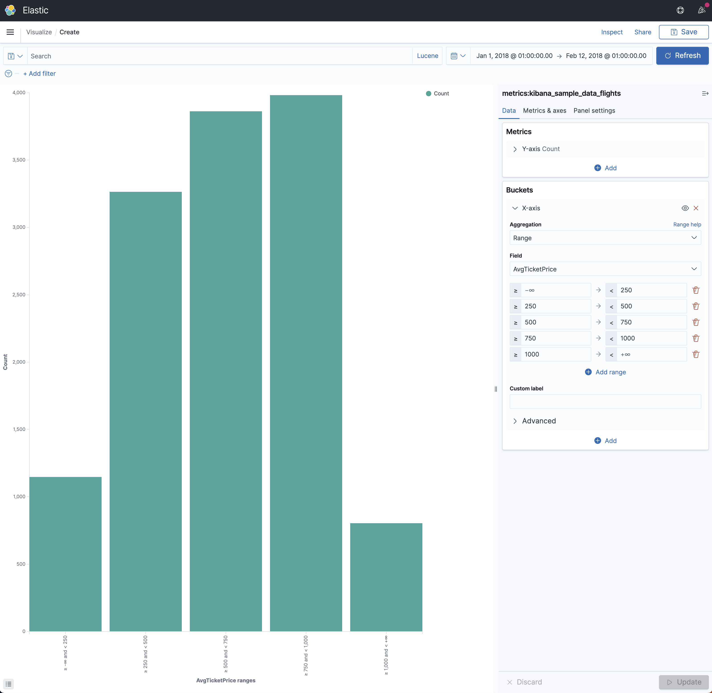

# Range

Range is a multi-bucket value source based aggregation that enables the user to define a set of ranges - each representing a bucket. Note that this aggregation includes the from value and excludes the to value for each range.



You will find below an example of the Kusto Query Language generated by K2Bridge when using this aggregation (indentation added for legibility).

```
let _data = database("metrics").['kibana_sample_data_flights']
| where (
    ['timestamp'] >= todatetime("2018-01-01T00:00:00.0000000Z") 
    and ['timestamp'] <= todatetime("2018-02-12T00:00:00.0000000Z")
);

let _extdata = _data
| extend ['2'] = pack_array(
    '250%500', '500%750'
    ),
    ['_range_value'] = pack_array(
        ['AvgTicketPrice'] >= 250 and ['AvgTicketPrice'] < 500,
        ['AvgTicketPrice'] >= 500 and ['AvgTicketPrice'] < 750
    )
| mv-expand ['2'] to typeof(string), ['_range_value']
| where ['_range_value'] == true;

let _summarizablemetrics = _extdata
| summarize count() by ['2']
| order by ['2'] asc;

(_summarizablemetrics\n| as aggs);
```
