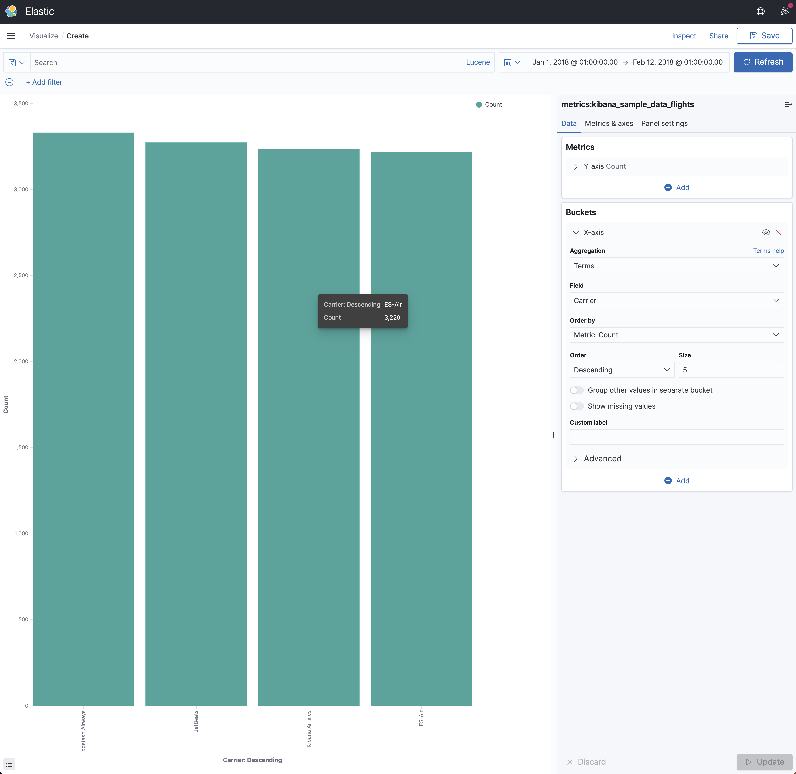

# Terms

A multi-bucket value source based aggregation where buckets are dynamically built - one per unique value.



```
let _data = database("metrics").['kibana_sample_data_flights']
| where (
    ['timestamp'] >= todatetime("2018-01-01T00:00:00.0000000Z") 
    and ['timestamp'] <= todatetime("2018-02-12T00:00:00.0000000Z")
);

let _extdata = _data
| extend ['2'] = ['Carrier'];

let _summarizablemetrics = _extdata
| summarize count() by ['2']
| order by ['count_'] desc
| limit 5;

(_summarizablemetrics | as aggs);

```
