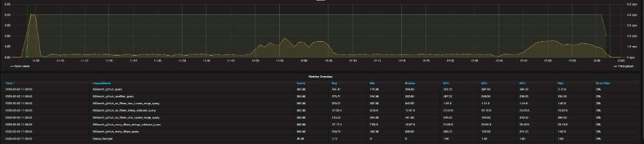
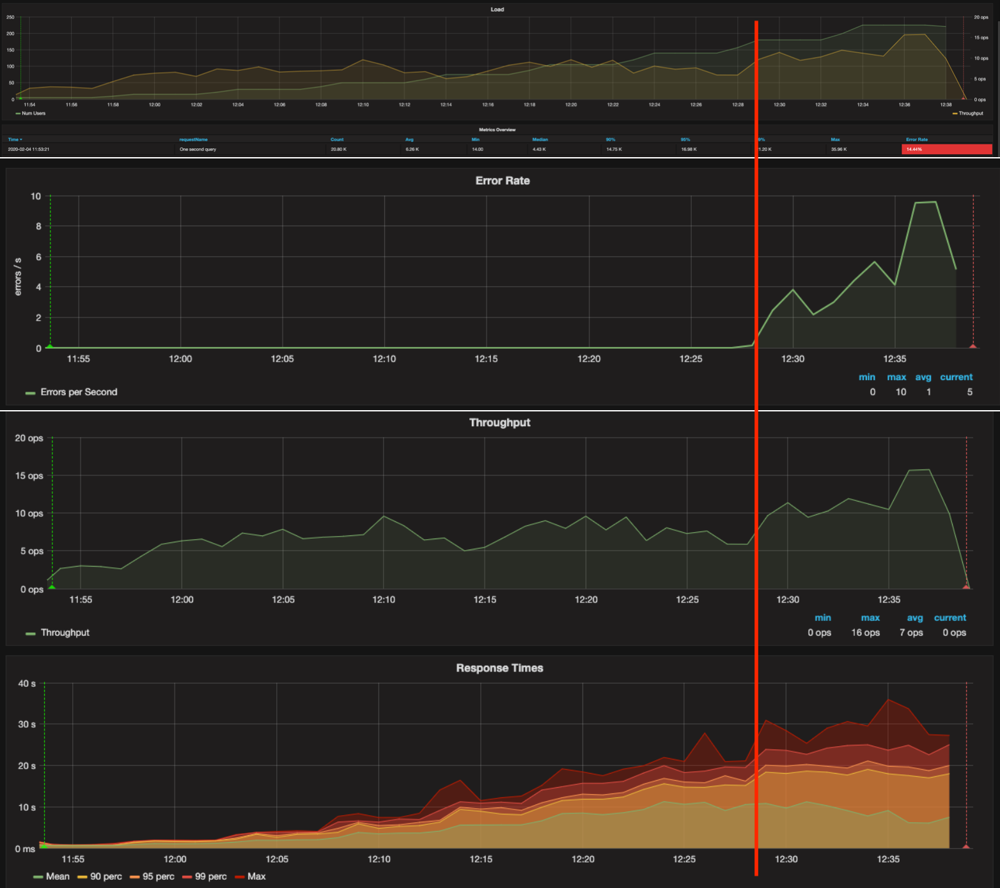
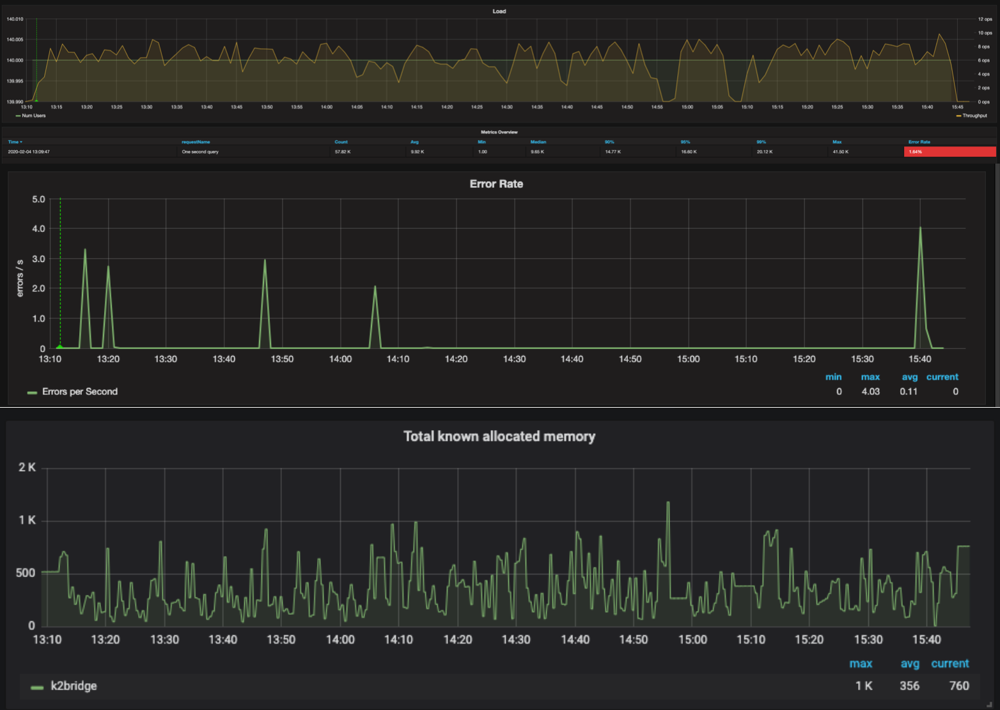
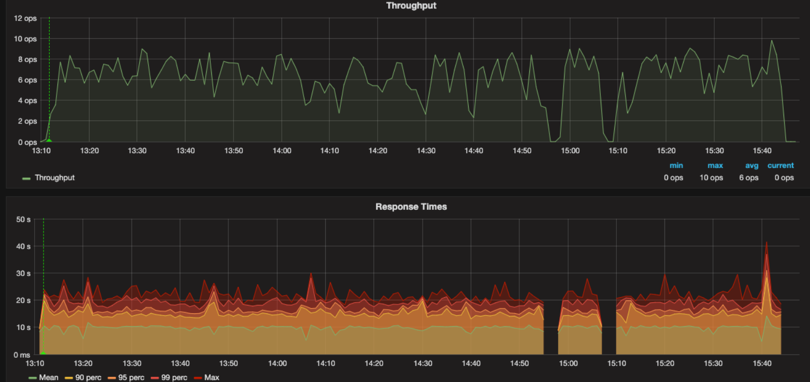

# Performance tests

In order to measure the performace of the K2Bridge, we performed several tests simulating typical use cases, and discovering the fail point for certain environment configuration.

## Dataset
The test are based on a the public github database, and the `pushevents` table with 20 columns and 10M entries.

## Test Spec
* Jmeter machine: 3G Mem (Max 8), 400m CPU (Max 1).
* AKS Performance cluster: 
    * Kubernetes version: 1.14.8
    * OS type: Linux
    * Node count: 3
    * Node size: Standard_DS3_v2
* K2 Bridge pods: 1

## Query types
The baseline performance test will consist of various queries:
1. A query that yields many columns.
2. A query with one filter.
3. A query with many filters.
4. A query based on many filters and string wildcard.
5. A query with no filters and one Lucene range.
6. query with no filters and string wildcard.
7. A query with no filters and two Lucene range.

## Test types
1. Baseline performance test consisted on the various query types.
2. Load test to find the fail point at a certain environment.
3. Soak test that runs on the same environment setup, just below the fail point, for few hours.

## Test results
### Baseline
Baseline test ran 5 users which executed 7 types of queries, in parallel order.
This test demonstrated the performance of each query type. 

__Consclusion__ 

After running the tests, we can see that queries without filters or wildcards were much faster, even if all columns were requested, which is expected. Queries with filters run much longer.

### Stepped Ramp up
Stepped Ramp up test gradually increased the user count in order to search the "breaking point". 

__Consclusion__ 

In our case, for the given pod spec the breaking point was 160 users.

### Soak test
Based on the breaking point, we ran a constant test of 140 users, just below the breaking point, in order to discover potential memory leaks and unexpected behaviors.

__Consclusion__ 

The result shows the system works as expected. The system maintain a stable behavior, memory usage, throughput and response time. 

## Available resources
You can experiemnt with the JMeter files we used:
1. [Baseline.jmx](Baseline.jmx)
2. [Stepped Rampup.jmx](stepped_ramp_up.jmx)
3. [Soak.jmx](Soak.jmx)

And the various queries we used:
1. [MSearch_github_many_filters_query.json](MSearch_github_many_filters_query.json)
2. [MSearch_github_many_filters_strings_wildcard_query.json](MSearch_github_many_filters_strings_wildcard_query.json)
3. [MSearch_github_no_filters_one_lucene_range_query.json](MSearch_github_no_filters_one_lucene_range_query.json)
4. [MSearch_github_no_filters_string_wildcard_query.json](MSearch_github_no_filters_string_wildcard_query.json)
5. [MSearch_github_no_filters_two_lucene_range_query.json](MSearch_github_no_filters_two_lucene_range_query.json)
6. [MSearch_github_one_second_query.json](MSearch_github_one_second_query.json)
7. [MSearch_github_onefilter_query.json](MSearch_github_onefilter_query.json)
8. [MSearch_github_query.json](MSearch_github_query.json)